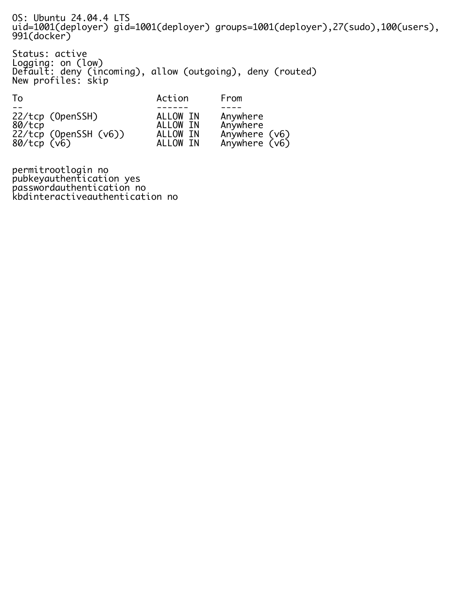

# Результаты проверки на Ubuntu VM

Проверка выполнена в отдельной Ubuntu 24.04.4 LTS VM под пользователем
`deployer` с Docker Compose v5.0.2. Оба сервиса запустились и перешли в
состояние `healthy`; приложение опубликовано на гостевом порту 80, а PostgreSQL
доступен только во внутренней Docker-сети. С хоста endpoint проверен через
проброс `localhost:8081` → `VM:80`.

## VM и сетевой доступ

Пользователь `deployer` входит в группы `sudo` и `docker`. UFW использует
политику deny для входящих подключений и разрешает только SSH и HTTP. В SSH
отключены вход по паролю и вход `root`.

## Запущенные контейнеры

## Health check

`GET /health` вернул `status: healthy` и `database: connected`.

## Сохранение данных

До `docker compose down` внутри VM создана запись с ID 1. После повторного
`docker compose up -d --wait` следующая запись получила ID 2, что подтверждает
сохранение данных в named volume.

## Размер образа

Скриншоты содержат только технический вывод тестового окружения; значения из
локального `.env` в них не выводятся.
